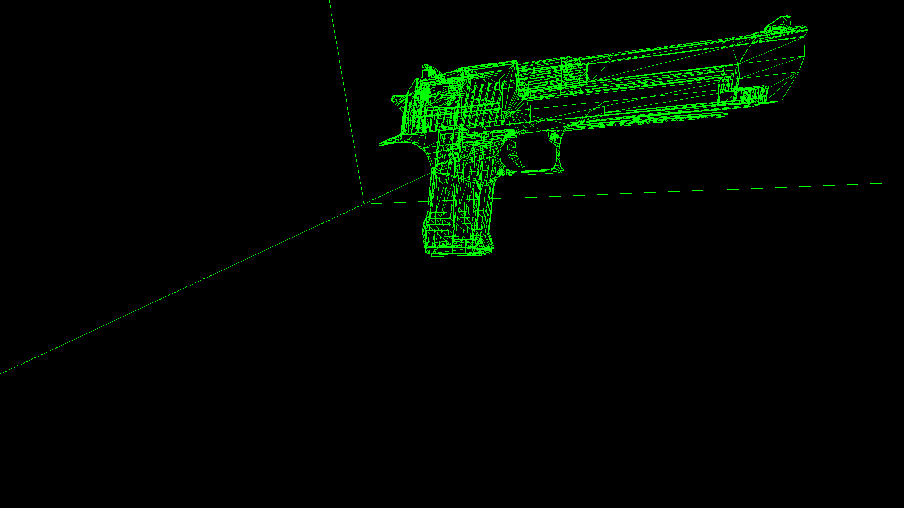
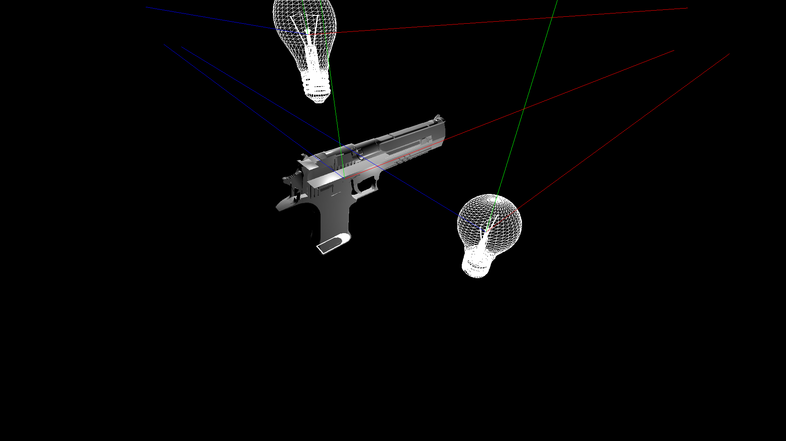

# LeanDX12
Wrapper library para DirectX 12. Para utilizá-la basta incluir o arquivo de cabeçalho LeanDX12.h (#include LeanDX12.h) e adicionar as seguintes dependências:

Em caso de dúvidas utilize como ponto de partida os códigos de exemplo fornecidos (Samples).

## LeanDX12 Samples
1. [Hello Render Target](Samples/LDX12HelloRenderTarget):
    
    
    
1. [Hello Triangle](Samples/LDX12HelloTriangle):
    
    
    
1. [Virtual Camera](Samples/LDX12VirtualCamera): Uso da função LoadWavefrontOBJ para carregar arquivo .obj contendo as informações dos vértices de um modelo de uma pistola *Desert Eagle*. Implementação de uma câmera virtual, transformando o espaço do mundo no espaço projetivo através de matrizes de translação, rotação, entre outras.
    
    
    
1. [Phong Illumination Model](Samples/LDX12PhongIllumination): Implementação do Modelo de Iluminação de Phong no Pixel Shader. Uso do algoritmo de interpolação Blinn-Phong (semelhante ao *Gouraud Shading*, entretanto o Blinn-Phong interpola os vetores normais dos vértices para estimar os vetores normais dos pontos da malha poligonal ao passo que o Gouraud interpola as cores dos vértices). A iluminação na cena foi computada da seguinte forma:


Imagens geradas:

  
  
Demais imagens em [Phong Illumination Images](Images/PhongIllumination)
  
    
Saída gerada no console todos os samples (a saída varia conforme a configuração de hardware):
```
Adaptador de video selecionado:
- Descricao: NVIDIA GeForce GTX 1050 Ti
- Memoria dedicada (VRAM): 3.92383 GB
- Memoria compartilhada (RAM): 7.94316 GB
```
